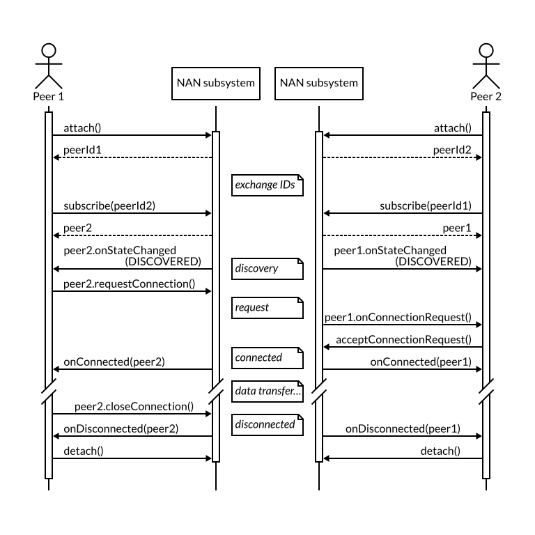

# Neighbour Awareness Networking JavaScript API


##### Table of Contents  

1. [Summary](#summary)
2. [Introduction to Neighbour Awareness Networking](#introduction-to-neighbour-awareness-networking)
3. [Use cases](#use-cases)
4. [Privacy and security](#privacy-and-security)
5. [Proposed solution](#proposed-solution)
6. [Implementation notes](#implementation-notes)

## Summary

Neighbour Awareness Networking ("NAN" from here on) (see [section 2](#introduction-to-neighbour-awareness-networking)), also known as Wi-Fi Aware, is an official Wi-Fi specification that enables mobile devices to discover and connect directly to each other without requiring any other type of connectivity between them.

Making this functionality available to websites would enable them to create fast and convenient connections between users who are physically close, opening up new ways of approaching the creation of Web solutions (see [section 3](#use-cases)).

However, this can not be done lightly: a careless use of this technology would pose severe threats to privacy and security (see [section 4](#privacy-and-security)).

This document presents a draft proposal for a JavaScript API for NAN (see [section 5](#proposed-solution)) that balances usefulness and user safety. It achieves this by changing the conceptual model from that of the underlaying network technology: instead of discovering and being discovered by every other node nearby, Web applications would register their interest in individual user sessions and would only be able to discover and connect to those.

The goal of this Web API is to make it easy to discover and connect to people who have allowed you to do so, and only to them.

This document also discusses an example protocol at the network level (see [section 6](#implementation-notes)): this protocol is intentionally kept simple, as its main purpose is to show the feasibility of implementing the proposed Web API.

## Introduction to Neighbour Awareness Networking

Neighbour Awareness Networking ("NAN" from here on), also known as Wi-Fi Aware, is an official Wi-Fi specification that enables mobile devices to discover and connect directly to each other without requiring any other type of connectivity between them.

NAN works by forming clusters with neighboring devices, or by creating a new cluster if the device is the first one. This clustering behaviour happens automatically and applications have no control over it.

Applications using NAN may publish one or more discoverable services and/or may subscribe to one or more of those services. Devices can be both publishers and subscribers at the same time.

Service advertisements in NAN contain the service name (up to 255 bytes) and may contain an optional *extra info* field with additional information (up to 255 bytes).

A subscriber will be notified when a matching publisher has been discovered, at which point it may exchange short messages or establish a fast bi-directional network connection with the other device.

Each discovery event or message received includes the MAC address of the originating peer. This MAC address will change periodically (every 30 minutes or so).

Short messages ("follow-up" in the specification) are 1-to-1 messages containing a payload of up to 255 bytes. Testing shows that they are exchanged at a rate of around 5-10 per second.

In order to establish a connection, both peers need to request it to their operating systems specifying the role of the peer (initiator or responder) and the MAC address of the other peer.

NAN connections are one-to-one and devices are only able to establish a limited number of them at the same time. These connections use IPv6 link-local addresses, for example `fe80::5e:63ff:fefb:be0%aware_data0`.

NAN is available right now for some [Android](https://developer.android.com/guide/topics/connectivity/wifi-aware) devices using Qualcomm chipsets (Pixel 2, Pixel 3, more coming in the near future). There are also implementations by companies like Intel, Broadcom and Marvell.

## Use cases

Note that this list does not attempt to be exhaustive and that the prototypes shown here were built using the Android API (and are therefore a bit more flexible than what a website can do).

### Fluid same-place collaboration

NAN makes possible the flexible interconnection of devices, enabling fluid collaboration with high bandwidth while improving privacy and security, as the data remains local to the users' devices.

NAN can be used to reduce the amount of data that is exchanged over the Internet, optimizing bandwidth usage and providing more functionality when devices are offline.

The videos below show a prototype app that lets users share and annotate documents without relying on existing network infrastructure.

* [VIDEO 1 - prototype using NFC to join a presentation, with live drawing](video/05_meshpresenter_1.mp4?raw=true)
* [VIDEO 2 - prototype sharing images between participants](video/06_meshpresenter_2.mp4?raw=true)
* [VIDEO 3 - prototype carrying out a poll](video/07_meshpresenter_3.mp4?raw=true)

### Fast transfer of files

NAN connections enable fast and convenient transfer of files between nearby devices, without the data having to be uploaded and downloaded to/from a remote server. The examples below use NFC to exchange the device's information, which is then used to establish the connection and transfer the files.

* [VIDEO 1 - prototype transfering 280 MB between two devices](video/08_awarebeam_1.mp4?raw=true)
* [VIDEO 2 - prototype transfering 172 MB from one device to another two](video/09_awarebeam_2.mp4?raw=true)
* [VIDEO 3 - prototype transfering several files at the same time](video/10_awarebeam_3.mp4?raw=true)

### Local gaming

NAN connections may be used for local gaming in situations where Internet access is unavailable or restricted. In the example videos below, one device acts as the game server through two 1-to-1 connections with the other two.

* [VIDEO 1 - prototype playing OpenArena](video/02_openarena_1.mp4?raw=true)
* [VIDEO 2 - prototype playing OpenArena](video/03_openarena_2.mp4?raw=true)

### Media streaming

NAN connections enable the streaming of HD media directly between nearby devices. Beyond the most obvious use cases (videocalls, etc.), the video below is a design exploration: a camera application that receives a stream of what your friends' cameras around you are pointing at, giving you different points of view of an event.

* [VIDEO - collaborative camera](video/collaborativecameratest.mp4?raw=true)

### Proximity detection

NAN discovery may be used by websites that want to trigger certain actions when two users are physically close to each other. For example, a chat website may detect that two users are close to each other and offer additional, NAN-based functionality. This can also be used as a complement to the Geolocation Web API.

### IoT

NAN may be used to connect and configure IoT devices without relaying on remote servers, improving privacy, flexibility, and trust.

### Connect the user's devices

NAN may be used to share information between a user's mobile and PC when they are close by, without relaying on an existing network infrastructure.

### Read more

* [“Mobile design with device-to-device networks”](https://darker.ink/blog/mobile-design-with-device-to-device-networks/) (blog)
* [“Mobile design with device-to-device networks”](https://fosdem.org/2019/schedule/event/device_to_device_networks/) (FOSDEM)
* [“P2P presentations”](https://darker.ink/blog/p2p-presentations/) (blog)
* [“Emergent IoT configurations for same-place collaboration”](https://darker.ink/static/media/TP1_IDM_Felipe_Erias_FINAL.pdf) (PDF)
* [RFC 7478: Web Real-Time Communication Use Cases and Requirements](https://tools.ietf.org/html/rfc7478)
* [WebRTC Next Version Use Cases](https://www.w3.org/TR/webrtc-nv-use-cases/) (working draft)
* [Wi-Fi Alliance](https://www.wi-fi.org/discover-wi-fi/wi-fi-aware)

## Privacy and security

A naïve approach to the Web NAN API would be to replicate the existing low-level API, providing functionality to:

+ advertise a service
+ receive a notification when a match has been found
+ sending small messages without creating a connection
+ establishing a connection
+ etc.

However, this naïve approach poses severe threats to privacy and security.

First, the user of the API would be notified of every nearby person who is using the same website, without asking their permission. This could lead to surveillance scenarios where websites detect and log everybody around the user.

Second, service announcements can be trivially spoofed. In the case of Android, there isn't any check or guarantee on the service name that you are announcing. In a hypothetical scenario, a website could use NAN to advertise as *"com.facebook"* and get matches for people using Facebook in the vicinity.

Third, the existing APIs do not require much in terms of permissions. For example, the Android API only requires permission to obtain the coarse location and to view and change the WiFi state, and applications may carry out NAN operations in the background. For websites, this poses a risk that a website might be doing things behind your back, even when you are not currently using it.

## Proposed solution

The challenge is to balance usefulness and user safety.

To do that, we must rethink how NAN is presented to the developer: instead of advertising and subscribing using services names, websites would discover and connect to specific user sessions.

Upon starting NAN, the user of the API would be assigned a unique `sessionId` object, the exact contents of which will depend on the implementation.

The user would receive the session IDs of other peers, and would use *those* to discover, validate and connect to them.

While this proposal relies on the exchange of these session IDs as a precondition to discovery and connection, it does not mandate a particular mechanism to do so. Two possible options could be:
 - via a secure exchange with the server
 - via a physical tap of the devices, using NFC

Another aspect that is not currently covered by this proposal is peer authentication.

### API Overview

The read-only property `Navigator.nan` returns an object of type `NanManager` that is the main contact point with the NAN subsystem.

The user of the API must being by invoking the `attach()` method which, if successful, will return the `sessionId` for the current session. Invoking the `attach()` method may trigger a permission request dialog, display an ongoing notification, etc.

```javascript
navigator.nan.attach()
  .then((sessionId) => {
    // NAN started
    // sessionID is our identifier for this session
  },
  (reason) => {
    // error while starting NAN
  });
```

In order to discover and connect to each other, peers must exchange their `sessionId`. This proposal doesn't mandate a particular mechanism to do so.

Once the user has received the `sessionId` of the other peer, it can invoke `NanManager.subscribe()` to obtain a `NanPeer` object representing the peer and providing updates on its state. The user can also get a list of the subscribed peers by calling `NanManager.getPeers()`.

```javascript
peer = navigator.nan.subscribe(peerId);

peer.onStateChanged = function(state) {
  // called when the peer's state changes
});
```

The `NanPeer` object may be used to request a connection to that peer:

```javascript
navigator.nan.onConnected = function(peer) {
  // called when a connection has been established
});

navigator.nan.onDisconnected = function(peer) {
  // called when a connection has been interrupted
});

peer.requestConnection().then(
  (peer) => {
    // connection established
  },
  (reason) => {
    // failed to establish a connection
  }
```

Upon receiving a connection request, the other peer will be prompted to accept or reject it:

```javascript
peer.onConnectionRequest = function() {
  // call acceptConnectionRequest() here with isAccepted=true to
  // accept the connection, or with isAccepted=false to reject it

  peer.acceptConnectionRequest(isAccepted)
});
```

When the connection is established, both peers will receive the event `NanManager.onConnected()`.

At that point, `peer.baseUrl` will contain the base address of the peer, which may then be used to exchange data (e.g. using WebRTC, although the exact mechanism is outside the scope of this proposal).

If the user wishes to end the connection, it may do so by invoking `peer.closeConnection()`. When the connection ends, both peers will receive the event `NanManager.onDisconnected()`.

Finally, the user may call `NanManager.detach()` to stop announcements, close all ongoing connections, and detach from the NAN subsystem.

### Sequence Diagram



### Draft API spec

Interface `NanManager`:

+ `attach()`: attach to the NAN service; returns a Promise that, when succesfully resolved, provides the `peerId` for this user session
+ `detach()`: ends the session and detaches the user from the NAN service (after calling this method, `peerId` will no longer be valid)
+ `subscribe(peerId)`: adds the peer identified by the given ID to the list of subscribed peers; returns the new `NanPeer` object
+ `unsubscribe(peerId)`: removes the peer
+ `getPeers()`: returns the collection of subscribed peers
+ `onConnected(peer)`
+ `onDisconnected(peer)`

Interface `PeerId`:

+ `toBytes()`
+ `fromBytes()`

Interface `NanPeer`:

+ `state`: read-only property containing the peer's current state (gone, discovered, connecting, connected…)
+ `baseUrl`: read-only property containing the peer's address, if a connection has been established
+ `onStateChanged()`: handler for when the peer's state changes
+ `requestConnection()`: requests a connection to the peer
+ `onConnectionRequest()`: handler for when a peer requests a connection
+ `acceptConnectionRequest(isAccepted)`: indicates that a pending connection request should be accepted
+ `closeConnection()`
+ `unsuscribe()`: remove this peer from the list of subscribed peers

### After the connection is established

The standard option for P2P communication once the connection is established would be WebRTC. However, NAN uses link-local IPv6 addresses that are not currently supported by WebRTC. More work will be needed on this area.

Related bugs:

+ [Mozilla Bug 1445771: Loopback and link-local addresses](https://bugzilla.mozilla.org/show_bug.cgi?id=1445771)
+ [Chromium Issue 9978: Ignoring link-local IPv6 addresses makes WebRTC fail on mobile devices linked via WiFi Aware](https://bugs.chromium.org/p/webrtc/issues/detail?id=9978)

## Implementation notes

The purpose of this section is to show the feasibility of the proposed API by sketching a possible protocol at the network level. Note that this protocol is just an example and is intentionally kept simple.

### Session values

In this example implementation, each new NAN session generates a `sessionId`containing two internal fields:

+ `sessionId.public` will be used to identify the peer in NAN service announcements
+ `sessionId.secret` will be used to validate connection attempts

This `sessionId` object may be serialised and de-serialised in order to be exchanged between peers.

### Service publishing

User Agents using the NAN JavaScript API will act as both publishers and subscribers.

Only one active session will be advertised at any time. NAN publishing and discovery is paused when the website is in the background.

Service announcements use a service name like e.g. `"org.w3c.example.nan.id"`, and place in the *extra info* field their `sessionId.public`.

When the current session is paused or finished, the *extra info* field is cleared so other peers are notified that the session is no longer active; if no other sessions become active, NAN publishing stops altogether shortly afterwards.

(Note: another option for the announcements would be to use the `sessionId.public` as the service name, which would have the benefit that only peers that knew it beforehand would be able to discover the node.)

### Discovery

Peers subscribe to the same service name, e.g. `"org.w3c.example.nan.id"`, and get discovery events for each nearby peer advertising the same.

Every time that the User Agent receives a new discovery event or the *extra info* field of a discovered peer changes, it will compare the information in the *extra info* field with the `public` values that the user had previously subscribed to.

Only if the values match, the User Agent will notify the user that a peer has been found.

Publishing and discovery stop when a website is not in the foreground.

### Connection

The implementation must consider two scenarios:

+ *symmetric*: both peers have each other's `sessionId`
+ *asymmetric*: following a one-way exchange of `sessionId` from one peer to another, e.g. via NFC

Connection requests are only possible between devices that have discovered each other. They follow this sequence:

+ *initiator* sends a `REQUEST` message that includes the `sessionId.secret` of both peers
+ *responder* validates the received secrets
+ if the secrets are invalid or the application rejects the connection, *responder* sends `REQUEST_REJECTED`
+ if the connection is not possible (internal error, too many active connections, etc.), *responder* sends `REQUEST_DROPPED`
+ if the secrets are valid and the connection is possible, *responder* sends `REQUEST_ACCEPTED`
+ if the request has been accepted, each peer proceeds to create its end of the network
+ when the connection has been established, each peer sends a `HELLO` message containing its IP address; from then on, they can use the connection to exchange data
+ when a peer closes the connection, it sends a `BYE` message

